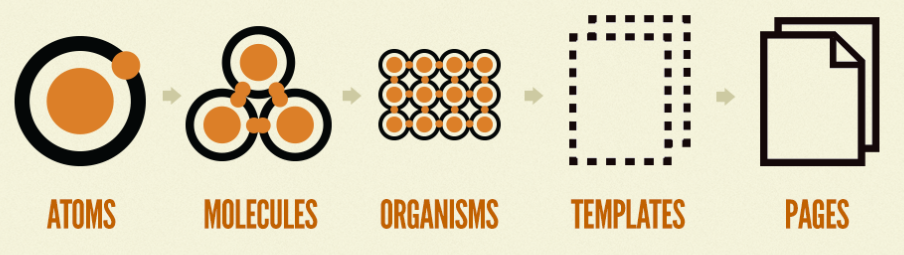

# Create a structure for the following components using "Atomic Design Architecture"

* Label
* Image
* Search bar (Text field, Button)
* Text field
* Paragraph
* Header (Search bar, Navigation menu)
* Body (Product card, Paragraph)
* Signup form (Label, Text field, Button)
* Product card (Image, Paragraph, Button)
* Footer (Secondary navigation menu, Paragraph)
* Page structure (Header, Body, Footer)
* Homepage (Page structure, with specific content: title, product cards, introductory text, etc.)
* Button

----

# Atoms
    - Your components
    
# Molecules
    - Your components

# Organisms
    - Your components

# Templates
    - Your components

# Pages
    - Your components