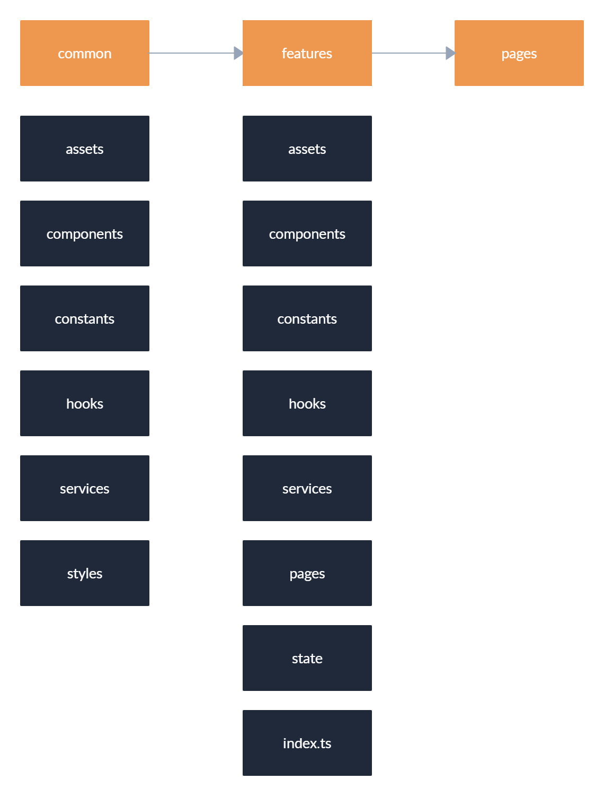

# Create a structure for the following components using "Feature Driven Design Architecture"

---

## Name layers
    * common
    * components
    * utils
    * state
    * pages
    * constants
    * interfaces
    * assets
    * features

---

## Components

- Auth Utils
- Button Component
- Table Component
- App Constants
- Auth Icon
- Login Interface
- Register Interface
- App Store
- Auth Page
- Paragraph Component
- Login Component
- Login Form
- Register Component
- App Utils
- Auth Slice
- App Logo

---

# Common

- common/

# Features

- features/

